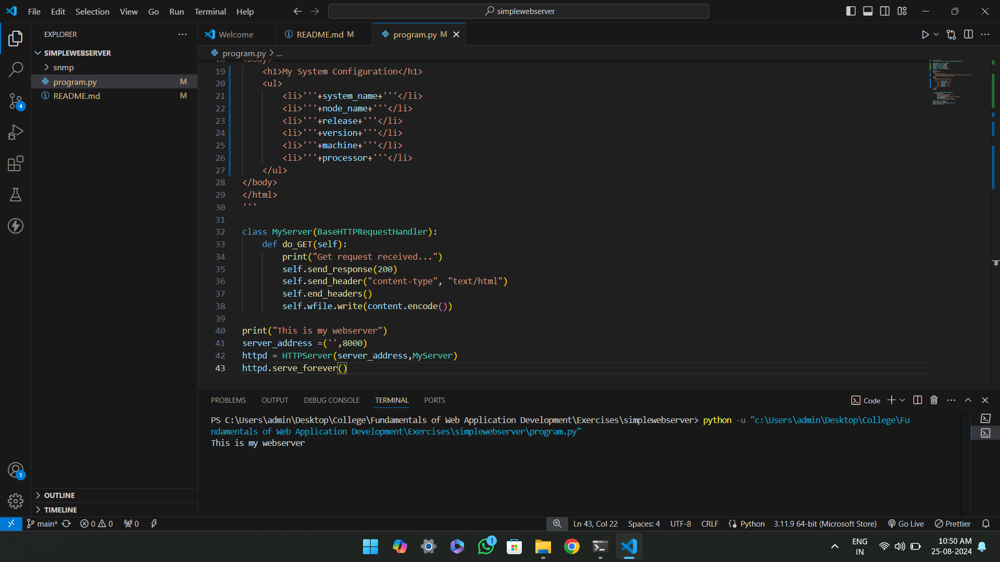
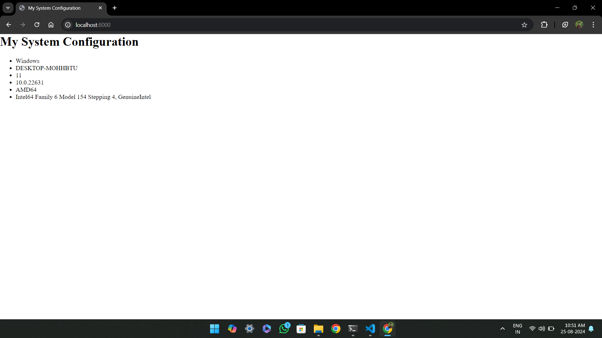

# EX01 Developing a Simple Webserver
## Date: 3-9-2024
## Name: GURU REVANTH KUMARAVEL RADHIKA
## Register Number: 212223230065

## AIM:
To develop a simple webserver to serve html pages and display the configuration details of laptop.

## DESIGN STEPS:
### Step 1: 
HTML content creation.

### Step 2:
Design of webserver workflow.

### Step 3:
Implementation using Python code.

### Step 4:
Serving the HTML pages.

### Step 5:
Testing the webserver.

## PROGRAM:
```python
import platform
from http.server import HTTPServer,BaseHTTPRequestHandler

system_name = platform.system()
node_name = platform.node()
release = platform.release()
version = platform.version()
machine = platform.machine()
processor = platform.processor()

content='''
<html lang="en">
<head>
    <meta charset="UTF-8">
    <meta name="viewport" content="width=device-width, initial-scale=1.0">
    <title>My System Configuration</title>
</head>
<body>
    <h1>My System Configuration</h1>
    <ul>
        <li>'''+system_name+'''</li>
        <li>'''+node_name+'''</li>
        <li>'''+release+'''</li>  
        <li>'''+version+'''</li>  
        <li>'''+machine+'''</li>  
        <li>'''+processor+'''</li>  
    </ul>
</body>
</html>
'''

class MyServer(BaseHTTPRequestHandler):
    def do_GET(self):
        print("Get request received...")
        self.send_response(200) 
        self.send_header("content-type", "text/html")       
        self.end_headers()
        self.wfile.write(content.encode())

print("This is my webserver") 
server_address =('',8000)
httpd = HTTPServer(server_address,MyServer)
httpd.serve_forever()
```


## OUTPUT:




## RESULT:
The program for implementing simple webserver is executed successfully.
